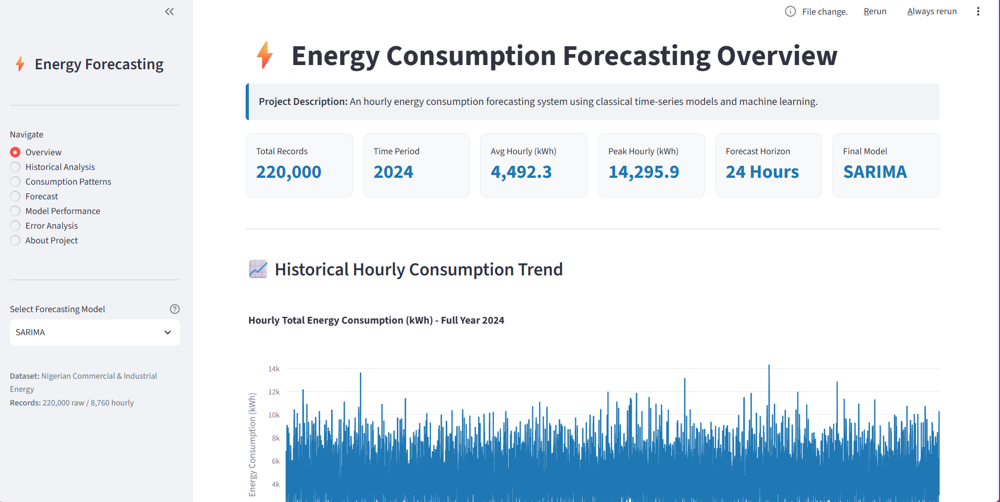
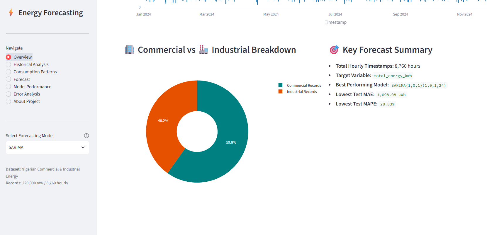
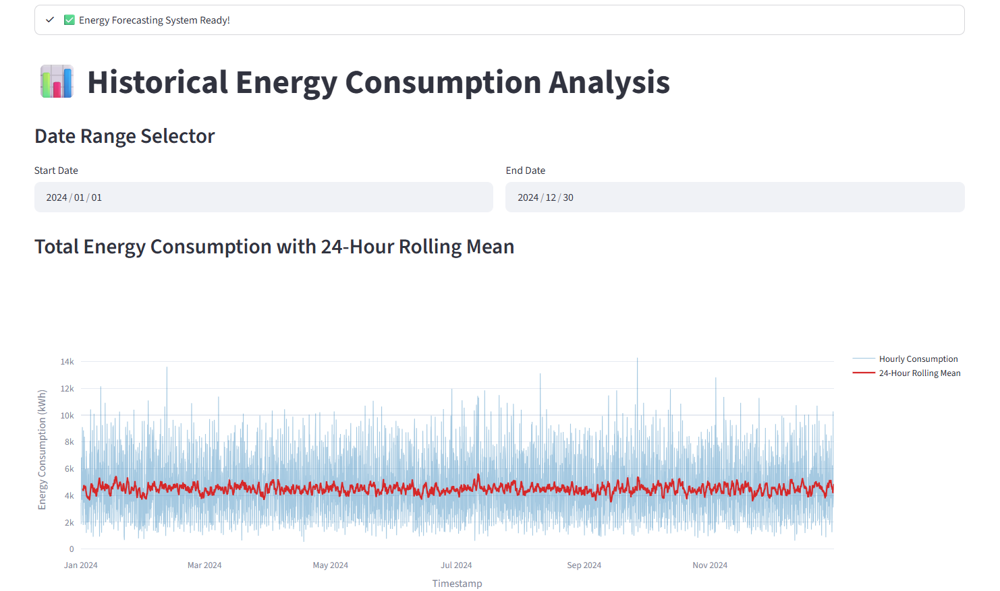
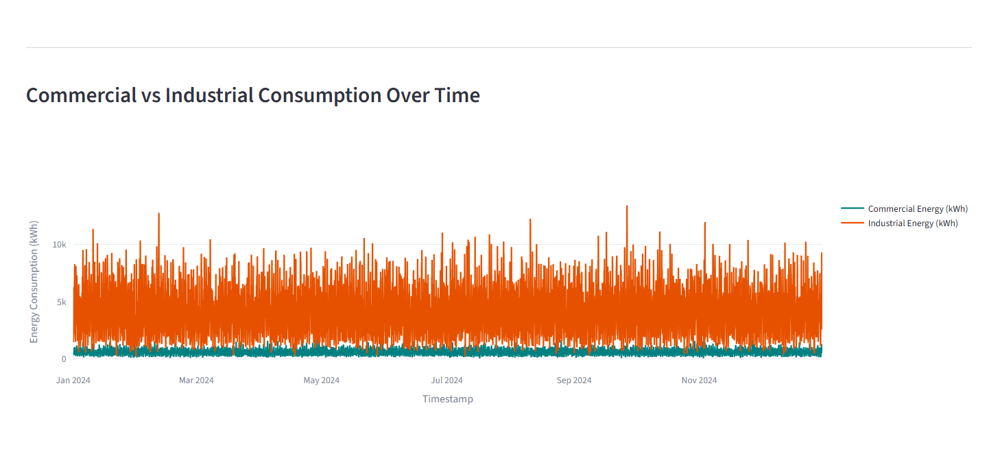
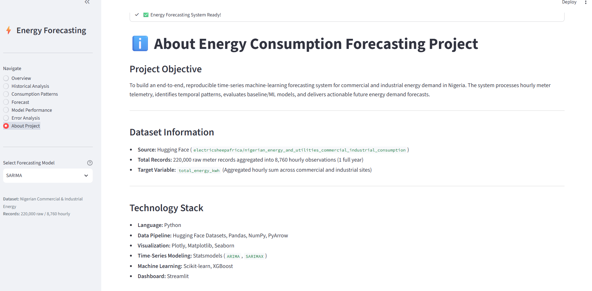

# Energy Consumption Forecasting Using Time-Series Machine Learning Models

An end-to-end, production-ready time-series machine learning forecasting application built with Python and Streamlit. This dashboard analyzes, models, and forecasts commercial and industrial hourly energy consumption using classical time-series techniques (ARIMA, SARIMA) and gradient-boosted machine learning (XGBoost).

---

## 📌 Project Overview

Energy consumption exhibits complex temporal patterns, strong diurnal cycles, and weekly seasonality. Accurate short-term demand forecasting is essential for utility load planning, grid stability, and energy management.

This project delivers a complete forecasting pipeline:

- Ingests smart meter telemetry from Hugging Face Datasets.
- Aggregates 220,000 raw records into an 8,760-hour continuous time series.
- Evaluates baseline, statistical, and ML forecasting models using chronological backtesting.
- Generates future 24-hour energy consumption forecasts using the best-performing model.
- Provides an interactive, modern analytics dashboard for exploring patterns and metrics.

---


## 📊 Dataset Information

- **Name:** Nigerian Energy & Utilities Commercial & Industrial Consumption
- **Source:** Hugging Face — `electricsheepafrica/nigerian_energy_and_utilities_commercial_industrial_consumption`
- **Total Raw Records:** 220,000 observations across 2024
- **Hourly Time Series:** 8,760 unique hourly timestamps
- **Commercial Records:** 131,577
- **Industrial Records:** 88,423
- **Primary Forecasting Target:** `total_energy_kwh` (Aggregated total energy across all sites per hour)

---

## ✨ Features & Dashboard Sections

1. **Overview Dashboard:** Executive KPI cards (Total Records, Average Hourly kWh, Peak Hourly kWh, Forecast Horizon, Final Model) and interactive historical trend chart.
2. **Historical Analysis:** Filterable consumption trends, 24-hour rolling averages, and commercial vs. industrial sector comparison with custom date-range controls.
3. **Consumption Patterns:** In-depth breakdown of diurnal hourly patterns (0–23h), day-of-week demand (Mon–Sun), monthly trends, and sector dynamics.
4. **24-Hour Forecast:** Interactive future 24-hour energy demand predictions with summary statistics (Average, Maximum, Minimum forecast) and downloadable forecast data table.
5. **Model Performance:** Formal benchmark comparison table (MAE, RMSE, MAPE) and visual performance charts comparing Naive, ARIMA, SARIMA, and XGBoost models.
6. **Error & Residual Analysis:** Holdout test predictions vs. actuals, SARIMA error distribution histogram, residual time series, top 10 absolute-error periods table, and XGBoost feature importance.
7. **About Project:** Concise documentation on project objectives, workflow, technology stack, limitations, and future improvements.

---

## 🤖 Models & Feature Engineering

### Evaluated Models

1. **Naive Baseline:** Predicts $y_t = y_{t-1}$ as a benchmark.
2. **ARIMA(1,0,1):** Non-seasonal autoregressive integrated moving average model.
3. **SARIMA(1,0,1)(1,0,1,24):** Seasonal ARIMA capturing daily 24-hour cycles.
4. **XGBoost:** Gradient boosted decision trees trained on temporal and lag features.

### Feature Engineering (XGBoost)

- **Calendar Features:** `hour`, `day_of_week`, `month`, `is_weekend`
- **Lag Features:** `lag_1` (previous hour), `lag_24` (previous day), `lag_168` (previous week)
- **Rolling Feature:** `rolling_mean_24` (24-hour moving average)

---

## 📈 Model Performance Benchmark

Models were evaluated on a chronological 80/20 train/test holdout set (6,873 train hours / 1,719 test hours):

| Model                          |    MAE (kWh) |   RMSE (kWh) |   MAPE (%) |
| ------------------------------ | -----------: | -----------: | ---------: |
| **Naive**                      |     1,526.52 |     1,997.77 |     38.75% |
| **ARIMA(1,0,1)**               |     1,509.61 |     1,876.04 |     43.81% |
| **SARIMA(1,0,1)(1,0,1,24)** ⭐ | **1,098.08** | **1,418.55** | **28.83%** |
| **XGBoost**                    |     1,138.61 |     1,466.70 |     30.11% |

_⭐ **SARIMA(1,0,1)(1,0,1,24)** achieved the lowest MAE, RMSE, and MAPE on the selected test period and is used for the final 24-hour forecast._

---

## 📁 Project Structure

```text
Project/
├── app.py                             # Streamlit interactive dashboard application
├── Energy_Consumption_Forecasting.ipynb # Complete Google Colab data science notebook
├── requirements.txt                   # Minimal project Python dependencies
└── README.md                          # Project documentation and user guide
```

---

## 🚀 Installation & Running the App

### Prerequisites

- Python 3.9+ installed on your system.

### 1. Clone or Download Project

```bash
git clone <repository_url>
cd Project
```

### 2. Install Required Dependencies

```bash
pip install -r requirements.txt
```

### 3. Run Streamlit Application

```bash
streamlit run app.py
```

The app will open automatically in your default browser at `http://localhost:8501`.

---

## 🖼️ Application Screenshots







---

## ⚠️ Limitations

1. **Exogenous Factors:** The current dataset excludes environmental telemetry like temperature, humidity, or solar irradiance.
2. **Operational Scope:** Designed as an analytical decision-support dashboard rather than an automated physical grid controller.

---

## 🔮 Future Improvements

- Integrate exogenous weather features and holiday calendars.
- Explore deep learning time-series architectures (Temporal Fusion Transformer, N-BEATS).
- Build automated REST API endpoints for real-time smart meter stream ingestion.
